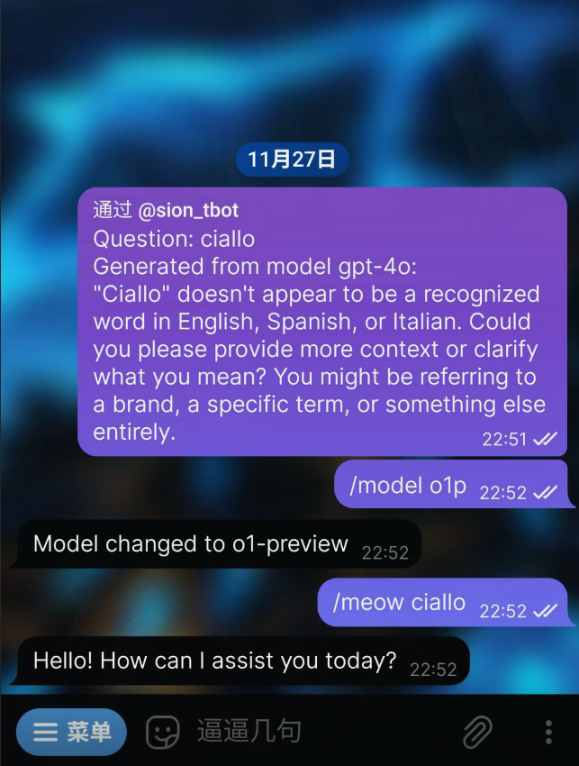

GPT Bot powered by [Github Models](https://github.com/marketplace/models)

### Supported Models
- o1-preview 
- o1-mini
- gpt-4o
- gpt-4o-mini



### Usage
#### Build&Run
```
cargo build --release
cd target/release
./sion --config-path /path/to/config.kdl
```

#### Commands
- `/help`
- `/meow \<prompt\>`
- `/model \<model\> - change model`

>```
>"4o" => OpenAIGPT4o,
>"4o-mini" | "4om" => OpenAIGPT4oMini,
>"o1-preview" | "o1p" => OpenAIGPTo1Preview,
>"o1-mini" | "o1m" => OpenAIGPTo1Mini,
>```
- /lookmodel

#### Inline
- Query should end with '喵'

### Config File
`$config_dir/sion/config.kdl` if not specified

#### Example
```
// This config is in the KDL format: https://kdl.dev
gpt {
    // Here is gpt url, normally https://models.inference.ai.azure.com/chat/completions
    base-url "https://example.com"
    // Here is your GitHub token.
    token "token"
}
bot {
    // Here is your Telegram Bot token.
    token "token"
    // Here is your user id.
    super-user-id 123
}
```